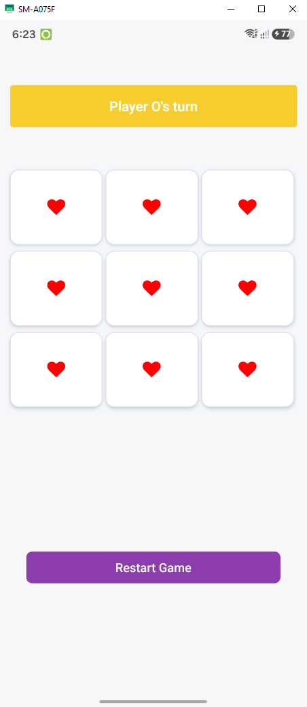
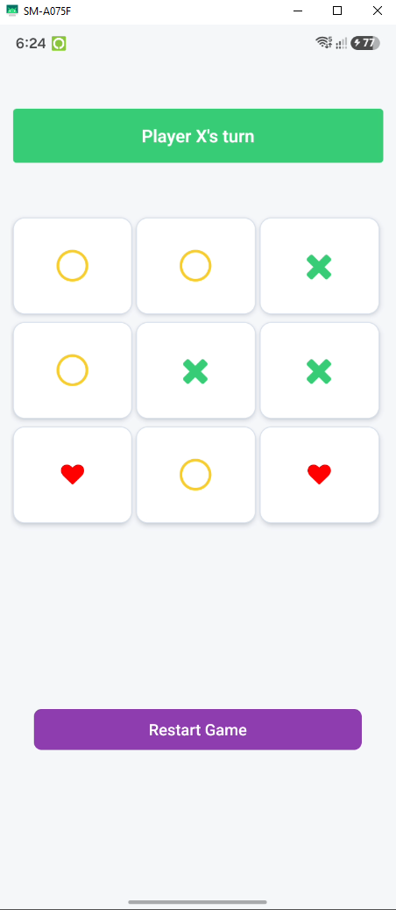
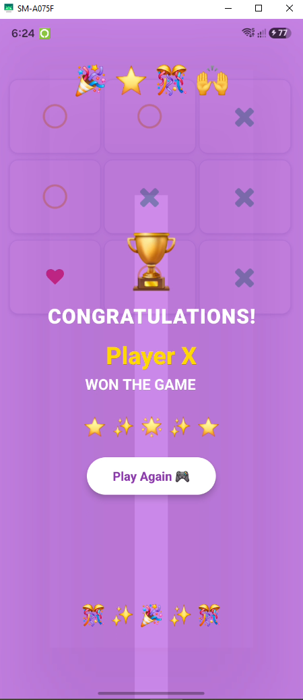

# ❌⭕ Tic Tac Toe App - React Native Game

An interactive, animated 2-Player Tic-Tac-Toe game built with React Native, TypeScript, vector icons, custom spring celebration animations, and snackbar alert notifications.

Developed as part of a **Mobile App Development & React Native Learning Series**.

---

## 📱 App Screenshots / Demo Preview

<div align="center">

| Turn State | Draw / Move State | Victory Celebration |
| :---: | :---: | :---: |
|  |  |  |

</div>

---

## ✨ Key Features

- 🎮 **2-Player Gameplay**: Classic 3x3 grid mechanics supporting turn-based strategy for Player X and Player O.
- ⚡ **Real-Time Win/Draw Detection**: Dynamic algorithm scanning 8 potential winning conditions (rows, columns, diagonals) after every turn.
- 🏆 **Spring & Loop Victory Animations**: Custom React Native `Animated` API celebration modals (spring scaling, fade-in opacity, bouncing emojis).
- 🔔 **Interactive Snackbar Notifications**: Native alerts via `react-native-snackbar` preventing moves on filled boxes or completed games.
- 🎨 **FontAwesome Vector Icons**: Clean `FontAwesome` vector graphics for Cross (`times`) and Circle (`circle-thin`) markers.
- 🔄 **Instant Game Reset**: One-tap game state reset function to start a new match instantly.

---

## 🛠️ Tech Stack & Tools

- **Framework**: [React Native](https://reactnative.dev/) (v0.87.1)
- **Language**: [TypeScript](https://www.typescriptlang.org/)
- **Icons**: [@react-native-vector-icons/fontawesome](https://github.com/react-native-vector-icons/react-native-vector-icons) (v13.1.4)
- **Toast Alerts**: [react-native-snackbar](https://github.com/coamm/react-native-snackbar) (v3.0.1)
- **UI & Layout**: React Native `FlatList` (3-column grid), `Animated` API, `Pressable`, `react-native-safe-area-context`
- **Build Tools**: Metro Bundler, Babel, ESLint, Prettier

---

## 🚀 Getting Started

Follow these instructions to set up and run the application on your local machine or emulator.

### Prerequisites

Ensure your React Native development environment is ready:
- **Node.js**: `>= 22.11.0`
- **npm** or **yarn**
- **Android Studio** (for Android Emulator) or **Xcode** (macOS only, for iOS Simulator)

### Installation

1. **Clone the Repository**
   ```bash
   git clone https://github.com/imtiazaly/Tic-Tac-Toe-App-React-Native.git
   cd Tic-Tac-Toe-App-React-Native
   ```

2. **Install Dependencies**
   ```bash
   npm install
   ```

3. **Start Metro Bundler**
   ```bash
   npm start
   ```

4. **Run the App**
   - **Android**:
     ```bash
     npm run android
     ```
   - **iOS**:
     ```bash
     cd ios && pod install && cd ..
     npm run ios
     ```

---

## 🧠 Logic & Architecture Highlights

### 1. Win Condition Checking Matrix (`src/App.tsx`)
Scans array indices to determine match outcomes:
```typescript
const checkIsWinner = (currentGameState: string[]) => {
  const winningConditions = [
    [0, 1, 2], [3, 4, 5], [6, 7, 8], // Rows
    [0, 3, 6], [1, 4, 7], [2, 5, 8], // Columns
    [0, 4, 8], [2, 4, 6]              // Diagonals
  ];

  for (const condition of winningConditions) {
    const [a, b, c] = condition;
    if (
      currentGameState[a] === currentGameState[b] &&
      currentGameState[a] === currentGameState[c] &&
      currentGameState[a] !== 'empty'
    ) {
      return currentGameState[a];
    }
  }
  return null;
};
```

### 2. Spring & Loop Celebration Animation
```typescript
Animated.parallel([
  Animated.spring(celebrationScale, {
    toValue: 1,
    friction: 5,
    tension: 60,
    useNativeDriver: true,
  }),
  Animated.loop(
    Animated.sequence([
      Animated.timing(emojiTranslate, { toValue: -15, duration: 600, useNativeDriver: true }),
      Animated.timing(emojiTranslate, { toValue: 15, duration: 600, useNativeDriver: true }),
    ])
  )
]).start();
```

---

## 📂 Project Structure

```text
Tic-Tac-Toe-App-React-Native/
├── assets/                  # App preview screenshots (ttt1.PNG, ttt2.PNG, ttt3.PNG)
├── src/
│   ├── components/
│   │   └── Icons.tsx        # FontAwesome icon renderer component
│   └── App.tsx              # Game state logic, grid rendering, & animations
├── index.js                 # App entry point
├── package.json             # Project dependencies and scripts
├── tsconfig.json            # TypeScript configuration
└── README.md                # Project documentation
```

---

## 👨‍💻 Learning Objectives

This project was built to explore core mobile application and game development patterns:
- Managing multi-state array grids (`gameState`) with TypeScript.
- Implementing game algorithms (Win/Draw matrix checking).
- Creating smooth UI animations using React Native's native-driven `Animated` API.
- Integrating external native libraries like `react-native-snackbar` and `@react-native-vector-icons`.

---

## 📄 License

This project is open-source and available under the [MIT License](LICENSE).
